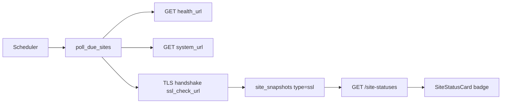

# Weryfikacja ważności certyfikatów SSL

| Pole | Wartość |
|---|---|
| **ID** | `002` |
| **Data** | 2026-07-01 |
| **Status** | `done` |
| **Moduł** | `monitor` (backend, frontend) |

## Odpowiedź: tak, da się wdrożyć

Architektura pull-only już to umożliwia — wystarczy dodać trzeci poll obok `/health` i `/system`. Nie trzeba zmieniać agenta ani zdalnych endpointów. Backend sam nawiąże połączenie TLS i odczyta certyfikat.



## Zakres (zgodnie z wyborem)

| Decyzja | Wartość |
|---------|---------|
| Adres sprawdzania | Opcjonalne pole **`sslCheckUrl`** per site — brak URL = brak sprawdzania |
| Overall status | Tylko **`expired`** podnosi główny badge (priorytet jak `failed`) |
| `expiring_soon` | Osobny badge SSL, bez wpływu na overall |

## Backend

### 1. Model i migracja

Nowa migracja `067_add_ssl_check_to_sites.py` (numeracja zgodna ze stanem repo — ostatnia to `066_add_token_version_to_users.py`):

- `ssl_check_url VARCHAR(500) NULL` — gdy puste, site nie jest sprawdzany
- `polling_ssl INTEGER NOT NULL DEFAULT 43200` (12h — certyfikaty rzadko się zmieniają)

Pliki:

- [`backend/app/modules/monitor/db_models.py`](backend/app/modules/monitor/db_models.py) — `SiteDB.ssl_check_url`, `SiteDB.polling_ssl` + dodać oba pola w `to_response()` (`sslCheckUrl`, `pollingSsl`), analogicznie do `health_url`/`polling_health`
- [`backend/app/modules/monitor/schemas.py`](backend/app/modules/monitor/schemas.py) — dodać `sslCheckUrl: Optional[str] = None` i `pollingSsl: int = Field(43200, ge=300)` (wzorzec jak `pollingUpdates`) do `SiteCreate`, `SiteUpdate` (opcjonalne) i `SiteResponse`
- [`backend/app/modules/monitor/router.py`](backend/app/modules/monitor/router.py) — `field_map` w `create_site()` i `update_site()` (linie ok. 159 i 226) mają osobne słowniki `db_field → schema_field` dla każdego pola; trzeba dopisać `ssl_check_url`/`sslCheckUrl` i `polling_ssl`/`pollingSsl` w obu miejscach. W `update_site()` jest też blok czyszczący stare snapshoty po wyczyszczeniu URL (`if "healthUrl" in data.model_fields_set and not data.healthUrl: delete_all_for_type(...)`) — potrzebny analogiczny blok dla `sslCheckUrl` → `delete_all_for_type(site_id, "ssl")`

### 2. Logika sprawdzania certyfikatu

Nowy plik `backend/app/modules/monitor/ssl_check.py`:

```python
# Pseudokod — asyncio.to_thread() dla blokującego socket/ssl
def fetch_cert(host, port, sni_host, connect_ip=None) -> dict:
    # ssl.CERT_NONE — zawsze odczytujemy cert (nawet self-signed / wygasły)
    # SNI = hostname z URL; connect_ip = site.ip gdy ustawione
    # Zwraca: not_after, not_before, issuer, subject, days_remaining
```

Statusy snapshota `ssl`:

| Status | Warunek |
|--------|---------|
| `ok` | `days_remaining > warning_days` |
| `expiring_soon` | `0 <= days_remaining <= warning_days` |
| `expired` | `days_remaining < 0` |
| `failed` | błąd połączenia, nieprawidłowy URL, brak certyfikatu |

Próg ostrzeżenia: globalny config w [`backend/app/core/config.py`](backend/app/core/config.py):

- `MONITOR_SSL_EXPIRY_WARNING_DAYS` (domyślnie **30**)

### 3. Integracja z pollerem

Rozszerzyć [`backend/app/modules/monitor/service.py`](backend/app/modules/monitor/service.py):

- `_poll_ssl(site)` — analogicznie do `_poll_health` / `_poll_system`, ale bez `httpx` (raw TLS handshake przez `ssl_check.py`), zapis przez `SnapshotRepository.create(site.id, "ssl", raw_data, error, status)` + `cleanup_old(site.id, "ssl")`, `dispatch_if_changed(site, snap)` na końcu — tak samo jak `_poll_health`/`_poll_system`
- W `poll_due_sites`: analogiczny blok `ssl_interval = min(site.polling_ssl, LIVE_POLL_INTERVAL) if live else site.polling_ssl`, throttling przez `site_times["ssl"]`, uruchamiany gdy `site.ssl_check_url`
- W `poll_site_now`: `if site.ssl_check_url: results["ssl"] = (await self._poll_ssl(site)).to_response()`

Istniejąca tabela `site_snapshots` obsługuje nowy `snapshot_type = 'ssl'` bez zmian schematu DB.

### 4. API

Rozszerzyć [`backend/app/modules/monitor/router.py`](backend/app/modules/monitor/router.py):

- `SiteStatusResponse` (w `schemas.py`) → dodać `sslSnapshot: Optional[SiteSnapshotResponse] = None`
- `_snapshot_for_site()` (linia ok. 34) — dodać gałąź `if snapshot_type == "ssl" and site.ssl_check_url: return snapshot`
- `_site_status_response()` (linia ok. 49) — przyjąć i przekazać dalej `ssl_snapshot`
- `list_site_statuses()` i `get_site()` — dociągnąć `ssl` z `snapshots_by_site.get(site.id, {}).get("ssl")` / `snap_repo.get_latest(site_id, "ssl")`
- Endpointy historii — **dwa miejsca** mają hardkodowaną walidację `if snapshot_type not in ("health", "system")`: `get_snapshots()` (linia ok. 294) i `get_snapshots_page()` (linia ok. 324) — w obu dodać `"ssl"`

### 5. Testy backend

- Unit test `ssl_check.py`: mock socket / przykładowe daty → statusy `ok` / `expiring_soon` / `expired`
- Test routera: site z `sslCheckUrl` zwraca `sslSnapshot` w `/site-statuses`

---

## Frontend

### 1. Typy i API

[`src/modules/monitor/types/index.ts`](src/modules/monitor/types/index.ts):

```typescript
export interface SslRawData {
  not_after?: string
  not_before?: string
  issuer?: string
  subject?: string
  days_remaining?: number
  hostname?: string
  port?: number
}

export type SslStatus = 'ok' | 'expiring_soon' | 'expired' | 'failed'

// Site: sslCheckUrl, pollingSsl
// SiteCreate: sslCheckUrl (SiteUpdate = Partial<SiteCreate>, bez zmian)
// SiteStatus: sslSnapshot

// Dedykowany union zamiast inline stringów (zgodnie z konwencją repo):
export type SnapshotType = 'health' | 'system' | 'ssl'
// SiteSnapshot.snapshotType: SnapshotType  (obecnie: 'health' | 'system' inline)
```

`SnapshotType` trzeba też podłączyć w miejscach, gdzie typ jest dziś zahardkodowany jako `'health' | 'system'`:

- [`src/modules/monitor/services/monitorQueries.ts`](src/modules/monitor/services/monitorQueries.ts) — `snapshots()` i `snapshotsPage()` (parametr `type`)
- [`src/modules/monitor/services/monitorService.ts`](src/modules/monitor/services/monitorService.ts) — `getSnapshots()` i `getSnapshotsPage()` (parametr `type`)

### 2. Style i badge

[`src/modules/monitor/utils/statusStyles.ts`](src/modules/monitor/utils/statusStyles.ts):

| Status | Kolor | Severity |
|--------|-------|----------|
| `cert_expired` / `expired` | czerwony (jak `failed`) | 6 |
| `expiring_soon` | amber (jak `degraded`) | 5 |

W UI overall używamy aliasu `cert_expired` (mapowany z `sslSnapshot.status === 'expired'`), żeby label brzmiał „Certyfikat wygasł” zamiast ogólnego „Failed”.

[`src/modules/monitor/composables/useSiteOverallStatus.ts`](src/modules/monitor/composables/useSiteOverallStatus.ts):

```typescript
// Po sprawdzeniu health failed, przed degraded:
if (s.sslSnapshot?.status === 'expired') return 'cert_expired'
```

`expiring_soon` **nie** zmienia overall.

**Uwaga — grupowanie stron:** [`SiteGroupSection.vue`](src/modules/monitor/components/SiteGroupSection.vue) używa `siteOverallStatus()` (przez `groupPrimaryStatus()`) razem z `groupHasIssue`, `groupHasCriticalIssue`, `groupBorderClass`, `groupBackgroundClass`, `groupIconClass` z `statusStyles.ts`, żeby obramować/podświetlić grupę serwera. `cert_expired` automatycznie popłynie przez `siteOverallStatus()`, ale te cztery mapy/funkcje w `statusStyles.ts` **nie mają dla niego wpisu** — trzeba dopisać:

- `GROUP_BORDER_CLASS.cert_expired` i `GROUP_BG_CLASS.cert_expired` i `GROUP_ICON_CLASS.cert_expired` (te same klasy co `failed`)
- `groupHasCriticalIssue()` obecnie sprawdza tylko `=== 'failed'` — dopisać `|| normalized === 'cert_expired'`, inaczej grupa z wygasłym certem nie dostanie czerwonego obramowania/tła, tylko domyślne amber

**Decyzja:** `expiring_soon` **nie** wpływa na wygląd karty grupy — pozostaje wyłącznie badge'em na pojedynczej `SiteStatusCard`. Skoro nie wchodzi do `siteOverallStatus()`, nie trzeba dopisywać go do `GROUP_BORDER_CLASS`/`GROUP_BG_CLASS`/`GROUP_ICON_CLASS` — te trzy mapy potrzebują wpisu tylko dla `cert_expired` (patrz wyżej).

### 3. Komponenty UI

- [`useSiteForm.ts`](src/modules/monitor/composables/useSiteForm.ts): dodać `sslCheckUrl: string` do `SiteFormData`, `SITE_FORM_DEFAULTS`, `siteToForm()` (wzorzec identyczny jak `healthUrl`/`systemUrl`)
- [`SiteFormFields.vue`](src/modules/monitor/components/SiteFormFields.vue): pole URL `sslCheckUrl` (opcjonalne, placeholder `https://example.com`, `type="url"`), label `monitor.fields.sslCheckUrl` — obok pól Health/System URL. **Uwaga w opisie pola**: sprawdzany jest tylko host[:port] z URL (domyślnie port 443), path/query są ignorowane — warto to zaznaczyć w hincie pod polem, żeby nie wyglądało jak pole do GET-owania endpointu.
- [`AddSiteDialog.vue`](src/modules/monitor/components/AddSiteDialog.vue) i [`EditSiteDialog.vue`](src/modules/monitor/components/EditSiteDialog.vue): przy budowaniu payloadu (`toNullableString(form.value.healthUrl)` itd.) dopisać `sslCheckUrl: toNullableString(form.value.sslCheckUrl)`
- [`SiteStatusCard.vue`](src/modules/monitor/components/SiteStatusCard.vue): linia „SSL:” z `SiteStatusBadge` gdy `sslSnapshot` istnieje; w nagłówku karty osobny badge `expiring_soon` (gdy overall jest `ok`)
- Nowa karta [`SiteDetailSslCard.vue`](src/modules/monitor/components/SiteDetailSslCard.vue): data wygaśnięcia, issuer, dni do końca, błąd ostatniego sprawdzenia. Wzorzec propsów jak [`SiteDetailHealthCard.vue`](src/modules/monitor/components/SiteDetailHealthCard.vue) — **ukryta całkowicie, gdy `sslCheckUrl` nie jest ustawiony** (`v-if="status.site.sslCheckUrl"` w `SiteDetailPage.vue`, bez stanu pustego/przycisku „Configure URL”), zgodnie z decyzją.
- [`SiteDetailPage.vue`](src/modules/monitor/pages/SiteDetailPage.vue): osadzenie karty SSL obok `SiteDetailHealthCard`/`SiteDetailSystemCard` (ok. linii 269–280)
- **[`SiteDetailSnapshotHistoryCard.vue`](src/modules/monitor/components/SiteDetailSnapshotHistoryCard.vue) — pominięte w pierwotnym planie, wymaga zmian:** ten komponent ma zahardkodowane taby `health`/`system` (`hasHealth`, `hasSystem`, `defaultTab`, osobne `useQuery` per typ z własną paginacją: `healthPage`/`healthPageSize`/`healthOffset` i analogicznie `systemPage`/…). Trzeba dodać trzeci tab `ssl`: `hasSsl = computed(() => !!props.site.sslCheckUrl)`, `sslPage`/`sslPageSize`/`sslOffset`, `useQuery` z `monitorQueryKeys.snapshotsPage(site.id, 'ssl', ...)`, nowy `<TabsTrigger value="ssl">` + `<TabsContent>` z tabelą (data, status, dni do wygaśnięcia, błąd)

### 4. i18n (PL + EN)

W [`src/shared/i18n/locales/pl.ts`](src/shared/i18n/locales/pl.ts) i `en.ts`:

- `monitor.status.certExpired` — „Certyfikat wygasł” / „Certificate expired”
- `monitor.status.expiringSoon` — „Bliski termin ważności” / „Expiring soon”
- `monitor.ssl` — „SSL”
- `monitor.fields.sslCheckUrl` — „URL do sprawdzania SSL”

### 5. Testy frontend

- `useSiteOverallStatus.spec.ts`: `expired` → `cert_expired`, `expiring_soon` bez zmian overall
- Ewentualnie test mapowania statusów SSL w `statusStyles`

---

## CLI

[`backend/cli/commands/monitor.py`](backend/cli/commands/monitor.py) — nowa kolumna w tabeli komendy `status` (funkcja `_status()`, ok. linii 316-326), np. `30d` / `EXPIRED` / `—` gdy brak URL.

**Uwaga na nazewnictwo:** komenda `sites list` (`_sites_list()`, linia 272) ma już kolumnę nagłówkowaną `"SSL"`, ale pokazuje `verify_ssl` (czy walidować certyfikat przy pollu HTTP) — zupełnie inna rzecz niż wygasanie certyfikatu. To inna tabela/komenda, więc technicznie nie ma konfliktu, ale żeby nie mylić użytkownika CLI, nowa kolumna w `status` powinna nazywać się np. `"Cert"` / `"Certyfikat"`, nie `"SSL"`.

---

## Poza zakresem (follow-up)

- **Alerty Teams/email** dla `expired` / `expiring_soon` — infrastruktura w [`alerts/dispatcher.py`](backend/app/modules/monitor/alerts/dispatcher.py) gotowa, wymaga nowego `alert_type: "ssl"` i filtrów w UI kanałów alertów
- Sprawdzanie certyfikatów pośrednich (load balancer vs origin) — wymagałoby wielu URL-i

## Ryzyka i uwagi

- **SNI + IP override**: przy `site.ip` łączymy się z IP, ale SNI/hostname bierzemy z `sslCheckUrl` (ten sam wzorzec co health poll w `service.py`, funkcja `_resolve_url` — SSL check jej nie użyje bezpośrednio, bo to nie `httpx`, ale logika SNI-vs-connect-IP musi być analogiczna)
- **Certyfikat zawsze odczytywany z `CERT_NONE`** — niezależnie od `verifySSL` (to flaga dla pollów HTTP, nie dla monitoringu certów)
- **Częstotliwość**: domyślnie 12h wystarczy; w live mode cap 30s jak pozostałe poll'e
- **`SiteDetailSnapshotHistoryCard.vue`** to jeden z większych plików dotykanych w tym zadaniu (3 niezależne stany paginacji zamiast generycznego podejścia) — pierwotny plan go pomijał; patrz sekcja Frontend §3
- **Grupowanie po statusie** (`SiteGroupSection.vue` + `statusStyles.ts`) wymaga osobnych wpisów dla `cert_expired` w mapach kolorów grupy i w `groupHasCriticalIssue()`, inaczej wygasły cert nie podświetli grupy na czerwono mimo że badge pojedynczej karty będzie poprawny — patrz Frontend §2
