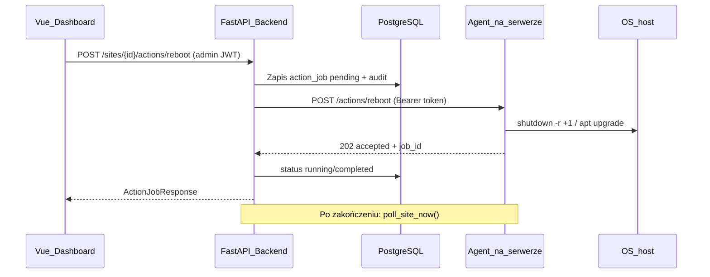

# Moduł akcji na monitorowanych serwerach

| Pole | Wartość |
|---|---|
| **ID** | `003` |
| **Data** | 2026-07-01 |
| **Status** | `cancelled` |
| **Moduł** | `monitor`, `agent` (backend, frontend) |

> **Anulowane (2026-07-24):** rezygnujemy z tego modułu — zbyt duże ryzyko (agent z uprawnieniami root/sudo do reboot/apt na monitorowanych serwerach, zdalne wykonywanie akcji uprzywilejowanych z centralnego dashboardu). Treść niżej zachowana jako historyczna analiza wykonalności, nie do implementacji.

## Odpowiedź krótka

**Tak, da się to zrobić**, ale to nie jest „dodanie guzika” — obecny system jest **pull-only i read-only**. Agent (`agent/agent.py`) ma tylko `GET /health` i `GET /system`; backend w [`backend/app/modules/monitor/service.py`](backend/app/modules/monitor/service.py) wykonuje wyłącznie `GET`. Jedyna „akcja” dziś to admin `POST .../poll` (ponowne odczytanie stanu).

Akcje reboot/upgrade wymagają nowej ścieżki: **dashboard → backend (admin + audit) → agent POST → host (root)**.



## Ograniczenia i założenia

| Temat | Decyzja |
|-------|---------|
| Które serwery | Tylko site'y z `system_url` (agent). Same `health_url` bez agenta — brak akcji OS |
| OS | Debian/Ubuntu (agent już używa APT i `/var/run/reboot-required`) |
| Uprawnienia agenta | Agent musi działać jako root lub mieć sudo na `reboot` / `apt` (zmiana unit systemd / Docker) |
| Bezpieczeństwo | `AdminUser` + `ConfirmDialog` + tabela audytu (bez dodatkowego 2FA) |
| Zakres faz | 1) reboot → 2) security upgrade → 3) full upgrade → 4) masowe |
| Wsparcie dla agentów w Dockerze | **Poza zakresem v1** — patrz sekcja „Uwaga: agent w Dockerze" niżej |

## Uwaga: agent w Dockerze nie może dziś wykonać reboot/upgrade hosta

Sprawdzone w [`agent/docker-compose.yml`](agent/docker-compose.yml) i [`agent/README.md`](agent/README.md): kontener agenta ma **tylko read-only bind mounty** (`/var/lib/apt/lists`, `/var/lib/update-notifier`, `/var/run`) i nie jest `--privileged`. `shutdown -r` / `apt upgrade` wykonane wewnątrz takiego kontenera działają na przestrzeni nazw kontenera, nie hosta — nie zrestartują ani nie zaktualizują serwera. Żeby to zadziałało, kontener musiałby dostać `--privileged` + `--pid=host` (praktycznie ucieczka z kontenera przez design) albo agent musiałby wykonywać komendy przez zamontowany `docker.sock`/`nsenter` na hoście — to osobny, większy kawałek pracy niż jedna linijka w tabeli bezpieczeństwa sugerowała.

**Decyzja dla v1**: akcje (`reboot` / `upgrade`) wspierane wyłącznie dla agentów zainstalowanych przez **systemd** (root lub sudoers, patrz „Wdrożenie agenta"). Dla site'ów, gdzie agent działa w Dockerze, `actions_enabled` (patrz niżej) powinno pozostać `false` — najlepiej ustawiane ręcznie po weryfikacji sposobu wdrożenia, nie domyślnie `true` dla wszystkich site'ów z `system_url`. Wsparcie dla akcji przez Dockera (jeśli w ogóle potrzebne) to osobny temat na przyszłość.

## Faza 1 — Reboot (MVP)

### 1. Agent — nowe endpointy akcji

Rozszerzyć [`agent/agent.py`](agent/agent.py):

- `POST /actions/reboot` — planowany restart (`shutdown -r +1` lub `systemctl reboot`)
- Flaga `AGENT_ACTIONS_ENABLED` (domyślnie `false`) — bez niej endpointy zwracają 403
- Ten sam `verify_token()` co `/system`, **ale**: jeśli `AGENT_ACTIONS_ENABLED=true` i `AGENT_TOKEN` jest puste, agent powinien odmówić startu (albo zwracać 500 na akcjach) zamiast dziedziczyć dzisiejsze zachowanie „puste = dev mode, brak auth". To zachowanie jest akceptowalne dla odczytu metryk, ale nie dla reboot/upgrade — zbyt duży blast radius na przypadkowo niedokonfigurowanym hoście
- **Mutex in-process** — odrzucenie równoległych akcji na jednym hoście
- Odpowiedź synchroniczna: `{ "status": "scheduled", "message": "..." }` (reboot rozłącza po ~60s)

Opcjonalnie na przyszłość: `GET /actions/status` — na MVP wystarczy audit po stronie centralnej + `poll_now` po czasie.

Zaktualizować [`agent/README.md`](agent/README.md) i skrypt instalacji systemd (uprawnienia root, nowa zmienna env).

### 2. Backend — warstwa akcji + audyt

Nowe pliki w [`backend/app/modules/monitor/`](backend/app/modules/monitor/):

| Plik | Rola |
|------|------|
| `actions/db_models.py` | Tabela `site_action_logs` |
| `actions/repositories.py` | CRUD logów |
| `actions/schemas.py` | `ActionType`, `ActionStatus`, request/response |
| `actions/service.py` | `ActionService` — wywołanie agenta, zapis audytu |
| `actions/router.py` | Endpointy REST |

**Model audytu** (`site_action_logs`):

- `id`, `site_id`, `user_id`, `action_type` (`reboot` / `upgrade_security` / `upgrade_all`)
- `status` (`pending` / `running` / `completed` / `failed`)
- `request_payload`, `response_payload`, `error_message`
- `created_at`, `completed_at`

**Endpointy** (wszystkie `AdminUser`):

```
POST /api/monitor/sites/{site_id}/actions/reboot
POST /api/monitor/sites/{site_id}/actions/upgrade   # body: { scope: "security" | "all" } — faza 2/3
POST /api/monitor/actions/bulk                     # body: { siteIds[], action, scope? } — faza 4
GET  /api/monitor/actions?site_id=&limit=          # historia audytu
```

**Logika wywołania agenta** — reużyć wzorce z [`service.py`](backend/app/modules/monitor/service.py):

- `_auth_headers()`, `_resolve_url()` — URL akcji wyliczyć z `system_url` przez `urlparse`, zamieniając tylko końcowy segment ścieżki na `/actions/reboot` (nie surowy string-replace na `/system` — mogłoby trafić np. na `/foo-system/system`)
- Dłuższy timeout dla upgrade (np. 300s) vs reboot (30s)
- Walidacja: site włączony, ma `system_url`, **`actions_enabled` per site — nowa kolumna bool, domyślnie `false`** (nie `true`; patrz „Uwaga: agent w Dockerze" — nie chcemy domyślnie włączonych akcji na site'ach, których sposób wdrożenia agenta nie został zweryfikowany)
- Po sukcesie reboot/upgrade: zamiast osobnego `asyncio.create_task` z ręcznym opóźnieniem, wywołać istniejące `activate_live_mode()` z [`scheduler.py`](backend/app/modules/monitor/scheduler.py) — poller już wtedy odpytuje due site'y w krótszym `LIVE_POLL_INTERVAL` przez `LIVE_MODE_TTL`, więc świeży status przyjdzie bez nowego mechanizmu i bez ryzyka pojedynczego nietrafionego jednorazowego opóźnienia

Migracja DB — **dwie zmiany**: nowa tabela `site_action_logs` + nowa kolumna `actions_enabled` (bool, default `false`) na `sites`. Wpis w `cli db migrate`.

### 3. Frontend — pojedynczy reboot

W [`src/modules/monitor/`](src/modules/monitor/):

**Typy** (`types/actions.ts`):
- `ActionType`, `ActionLog`, `BulkActionRequest`

**Serwis** (`services/monitorService.ts`):
- `rebootSite(siteId)`, `getActionLogs(...)`

**UI — miejsce guzików** (zgodnie z istniejącym wzorcem `CommonPageHeader #actions` i kart systemowej):

1. [`SiteDetailSystemCard.vue`](src/modules/monitor/components/SiteDetailSystemCard.vue) — przycisk **Reboot** widoczny gdy `reboot_required === true` (destructive outline)
2. [`SiteDetailPage.vue`](src/modules/monitor/pages/SiteDetailPage.vue) — `ConfirmDialog` z nazwą serwera + ostrzeżeniem; po sukcesie toast + invalidate queries
3. Nowa karta **`SiteDetailActionsCard.vue`** — ostatnie akcje na tym site (GET `/actions?site_id=`)
4. Toggle **`actionsEnabled`** w [`SiteFormFields.vue`](src/modules/monitor/components/SiteFormFields.vue) / [`useSiteForm.ts`](src/modules/monitor/composables/useSiteForm.ts) (ten sam wzorzec co istniejący `verifySSL`) — bez tego kill switch z sekcji „Bezpieczeństwo" byłby ustawialny tylko z poziomu DB/CLI, co kłóci się z założeniem, że admin ma nad tym kontrolę z UI

Wzorzec jak przy usuwaniu site w `SiteDetailPage` — `ConfirmDialog` + `useHandleError` + `vue-sonner`.

i18n: `src/modules/monitor/i18n/` — klucze `monitor.actions.*`.

---

## Faza 2 — Aktualizacje security

### Agent
- `POST /actions/upgrade` z body `{ "scope": "security" }`
- Wykonanie: `DEBIAN_FRONTEND=noninteractive apt-get update && apt-get upgrade -y $(apt list --upgradable 2>/dev/null | grep security ...)` lub `unattended-upgrade` / `apt upgrade` z filtrem security
- Zwraca podsumowanie: ile pakietów, czy wymaga rebootu
- **Ważne**: `apt upgrade` może trwać dłużej niż jest to wygodne dla pojedynczego blokującego requestu. Zaprojektować to od razu jako uruchomienie procesu w tle (subprocess odpięty od requestu) + endpoint zwracający `202` z `job_id` natychmiast, zamiast bloków HTTP handlera na cały czas trwania apt. W przeciwnym razie: backend timeout (300s) ucina połączenie, ale apt na agencie może dalej działać — stan „czy upgrade się wykonał" staje się niejednoznaczny. Nie odkładać tego do „jeśli sync nie wystarczy" (patrz sekcja Ryzyka) — przy realnych aktualizacjach security prawdopodobieństwo przekroczenia sync-timeoutu jest wysokie od pierwszego wdrożenia

### Backend + UI
- Endpoint `POST .../actions/upgrade` z walidacją `scope`
- Przycisk w `SiteDetailSystemCard` gdy `security_updates > 0`
- Dłuższy spinner / status „w toku” (akcja może trwać minuty)
- Po zakończeniu: automatyczny `poll_now`

---

## Faza 3 — Pełny apt upgrade

- Ten sam endpoint z `scope: "all"`
- Przycisk gdy `system_state === "outdated"` i brak pilnych security (lub osobny „Upgrade all”)
- **Silniejsze ostrzeżenie** w dialogu (downtime, reboot możliwy)
- Opcjonalnie: blokada gdy `reboot_required` — najpierw reboot lub upgrade, potem reboot (kolejność w UI)

---

## Faza 4 — Operacje masowe

### Backend
- `POST /api/monitor/actions/bulk` — iteracja po `site_ids`, tworzenie osobnych wpisów audytu
- Równoległość ograniczona (np. `asyncio.Semaphore(3)`) — uniknięcie przeciążenia
- Częściowy sukces: odpowiedź `{ results: [{ siteId, status, error? }] }`

### Frontend
Na [`MonitorPage.vue`](src/modules/monitor/pages/MonitorPage.vue):

1. **Tryb zaznaczania** — checkboxy na `SiteStatusCard` (`@click.stop` żeby nie nawigować)
2. Pasek akcji w `CommonPageHeader` lub floating bar: „Reboot selected (N)”, „Upgrade security (N)”
3. Skróty kontekstowe na przefiltrowanym widoku: „Reboot all with issues” (filtr `reboot_required` / `outdated`)
4. Dialog potwierdzenia z listą nazw serwerów (max 10 + „i X więcej”)
5. Podsumowanie wyników (toast + ewentualnie modal z tabelą błędów)

Brak gotowego wzorca bulk w module — alert channels mają tylko checkboxy filtrów w [`ChannelFiltersForm.vue`](src/modules/monitor/components/ChannelFiltersForm.vue).

---

## Bezpieczeństwo (wybrany poziom)

- **Auth**: istniejący `AdminUser` z [`backend/app/modules/auth/dependencies.py`](backend/app/modules/auth/dependencies.py)
- **Potwierdzenie**: `ConfirmDialog` z wpisaniem nazwy serwera dla reboot / bulk (opcjonalnie, zalecane dla bulk)
- **Audyt**: każda akcja → `site_action_logs` z `user_id`, timestamp, payload
- **Agent**: `AGENT_ACTIONS_ENABLED=true` tylko na zaufanych hostach; token Bearer jak dziś
- **Per-site kill switch**: kolumna `actions_enabled` w `sites` — wyłączenie akcji bez usuwania monitoringu
- **Brak 2FA step-up** (zgodnie z wyborem) — można dodać później bez zmiany API

---

## Wdrożenie agenta (operacyjne)

Obecny agent nie wymaga root do odczytu metryk. Dla akcji:

- **systemd**: `User=root` lub `CapabilityBoundingSet=CAP_SYS_BOOT` + sudoers dla apt — jedyna wspierana ścieżka dla akcji w v1
- **Docker**: poza zakresem v1 (patrz „Uwaga: agent w Dockerze" wyżej) — `--privileged` + `--pid=host` to w praktyce kontrolowana ucieczka z kontenera i wymaga osobnej analizy bezpieczeństwa, nie jest to jednolinijkowa zmiana konfiguracji compose
- Rolling update agentów na serwerach przed włączeniem guzików w UI — dla site'ów z agentem w Dockerze zostawić `actions_enabled=false` do czasu decyzji o tej ścieżce

---

## Szacowany nakład

| Faza | Zakres | Szacunek |
|------|--------|----------|
| 1 Reboot | agent + backend audit + UI single | ~2–3 dni |
| 2 Security | upgrade endpoint + UI | ~1–2 dni |
| 3 Full upgrade | ten sam endpoint, inny scope | ~0.5–1 dnia |
| 4 Bulk | bulk API + selection UI | ~2 dni |

---

## Ryzyka

- **Reboot rozłącza agenta** — UI musi komunikować „zaplanowano”, nie „ukończono natychmiast”; weryfikacja przez poll po czasie
- **Upgrade trwa długo** — HTTP timeout; agent musi uruchamiać apt jako proces w tle i zwracać `202 Accepted` + `job_id` od razu w fazie 2 (patrz decyzja w sekcji Fazy 2), a nie tylko „w razie potrzeby"
- **Sieć** — centralny backend musi mieć dostęp POST do agenta (ten sam co GET dziś)
- **Wersjonowanie agenta** — backend powinien obsłużyć brak endpointu (404 → czytelny błąd „zaktualizuj agenta”)

## Rekomendacja startu

Zacząć od **Fazy 1 (reboot)** end-to-end na jednym serwerze dev (docker-compose z agentem), potem rollout agenta na produkcję, dopiero potem kolejne fazy i bulk.
