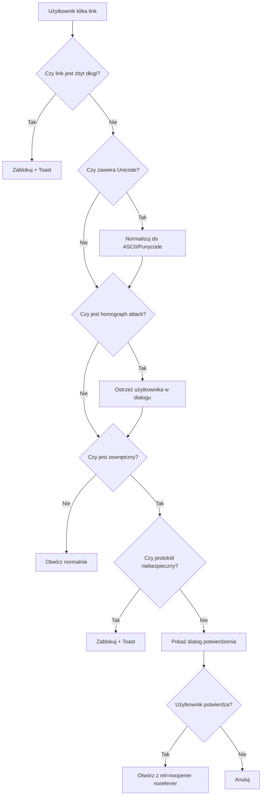
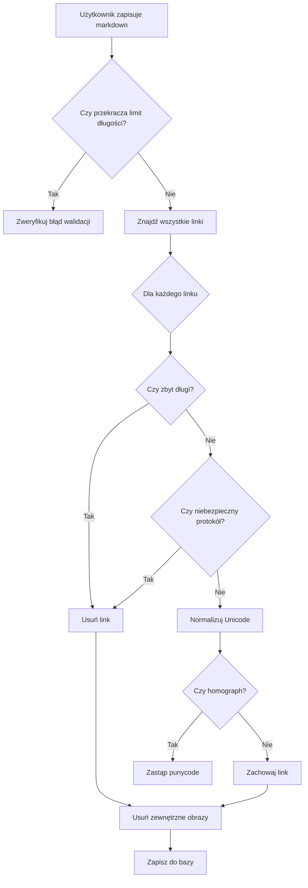
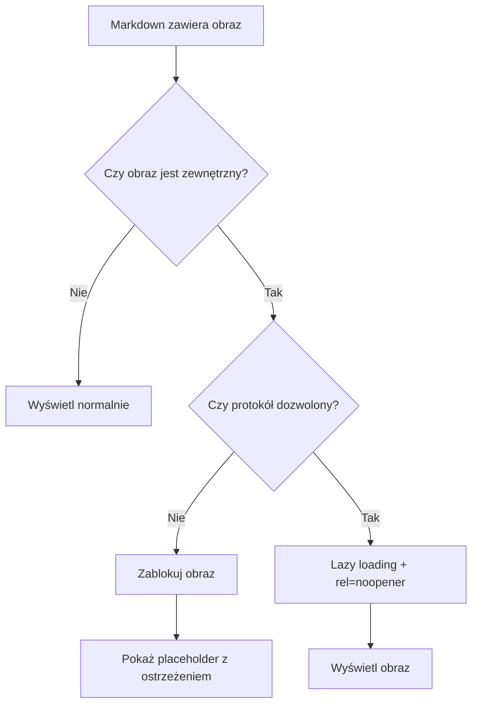

# Zabezpieczenie linków w markdown (rozszerzona wersja)

> **⚠️ UWAGA: Plan do weryfikacji**  
> Ten plan wymaga przeglądu przed implementacją. Proszę zweryfikować wszystkie założenia i szczegóły techniczne.

## Cel
Implementacja kompleksowych mechanizmów bezpieczeństwa dla markdown: walidacja linków, ochrona przed atakami homograph, limity długości, blokowanie zewnętrznych obrazów oraz sanityzacja Unicode.

## Architektura

### Frontend

1. **Utility do walidacji linków** (`src/shared/utils/linkSecurity.ts`)
   - `isExternalLink(url: string): boolean` - sprawdza czy link jest zewnętrzny
   - `isDangerousProtocol(url: string): boolean` - sprawdza niebezpieczne protokoły
   - `sanitizeLink(url: string): string | null` - usuwa niebezpieczne protokoły
   - `validateLinkLength(url: string, maxLength: number = 2048): boolean` - sprawdza długość linku
   - `detectHomograph(url: string): { isHomograph: boolean, normalized: string }` - wykrywa i normalizuje homograph attacks
   - `sanitizeUnicodeInUrl(url: string): string` - normalizuje Unicode do ASCII (punycode dla domen)
   - `isExternalImage(src: string): boolean` - sprawdza czy obraz jest zewnętrzny
   - `sanitizeMarkdownContent(content: string, maxLength: number = 50000): string | null` - sanityzuje cały markdown

2. **Composable do obsługi bezpiecznych linków** (`src/shared/composables/useSafeLink.ts`)
   - `handleLinkClick(event: MouseEvent, url: string): void` - przechwytuje kliknięcia
   - `handleImageLoad(event: Event, src: string): void` - obsługuje ładowanie obrazów
   - Pokazuje dialog dla zewnętrznych linków
   - Blokuje niebezpieczne protokoły i bardzo długie linki
   - Normalizuje homograph attacks

3. **Komponent dialogu potwierdzenia** (`src/shared/components/SafeLinkDialog.vue`)
   - Dialog z ostrzeżeniem przed otwarciem zewnętrznego linku
   - Wyświetla znormalizowany URL (po sanityzacji Unicode)
   - Ostrzeżenie o potencjalnym homograph attack (jeśli wykryty)
   - Przyciski: "Anuluj" i "Otwórz"

4. **Modyfikacja komponentów renderujących markdown:**
   - `src/modules/gear/components/MarkdownRenderer.vue`
     - Dodanie listenera na linki po renderowaniu
     - Blokowanie zewnętrznych obrazów w markdown (lub lazy loading z rel=noopener)
     - Dodanie `rel="noopener noreferrer"` do zewnętrznych linków
     - Sanityzacja Unicode przed renderowaniem
   - `src/modules/ai/components/AiChatMessage.vue` - analogicznie

5. **Konfiguracja limitów** (`src/shared/config/markdownSecurity.ts`)
   - `MAX_LINK_LENGTH = 2048` - maksymalna długość pojedynczego linku
   - `MAX_MARKDOWN_LENGTH = 50000` - maksymalna długość całego markdown
   - `ALLOWED_IMAGE_PROTOCOLS = ['http:', 'https:']` - dozwolone protokoły dla obrazów
   - `BLOCKED_PROTOCOLS = ['javascript:', 'data:', 'vbscript:', 'file:', 'about:']` - zablokowane protokoły

6. **Tłumaczenia** (`src/shared/i18n/locales/en.ts`, `src/shared/i18n/locales/pl.ts`)
   - `markdown.linkSecurity.*`:
     - `warningTitle`: "Ostrzeżenie: Zewnętrzny link"
     - `warningDescription`: "Czy na pewno chcesz otworzyć ten link?"
     - `urlLabel`: "URL:"
     - `homographWarning`: "Uwaga: Ten link może wyglądać jak znana domena, ale używa znaków Unicode"
     - `linkTooLong`: "Link jest zbyt długi i został zablokowany"
     - `contentTooLong`: "Treść markdown jest zbyt długa (maksymalnie {max} znaków)"
     - `dangerousProtocolBlocked`: "Niebezpieczny protokół został zablokowany"
     - `externalImageBlocked`: "Obrazy z zewnętrznych źródeł są zablokowane ze względów bezpieczeństwa"
     - `open`: "Otwórz"
     - `cancel`: "Anuluj"

### Backend

1. **Walidator linków** (`backend/app/modules/gear/validators.py`)
   - `validate_markdown_link(url: str, max_length: int = 2048) -> bool` - walidacja linku
   - `sanitize_markdown_content(content: str, max_length: int = 50000) -> str` - sanityzacja markdown
   - `detect_homograph(url: str) -> tuple[bool, str]` - wykrywanie homograph attacks
   - `sanitize_unicode_in_url(url: str) -> str` - normalizacja Unicode (używa `idna` dla domen)
   - `remove_external_images(content: str) -> str` - usuwa obrazy z zewnętrznych źródeł z markdown
   - Dozwolone protokoły: `http:`, `https:`
   - Blokowane: `javascript:`, `data:`, `vbscript:`, `file:`, `about:`, itp.

2. **Modyfikacja schemas** (`backend/app/modules/gear/schemas.py`)
   - Dodanie walidatorów do pól `notes` i `description`:
     - `ItemCreate.notes` - max 50000 znaków, sanityzacja linków
     - `ItemUpdate.notes` - max 50000 znaków, sanityzacja linków
     - `ContainerCreate.description` - max 50000 znaków, sanityzacja linków
     - `ContainerUpdate.description` - max 50000 znaków, sanityzacja linków
   - Użycie `field_validator` z Pydantic
   - Walidacja długości przed sanityzacją

3. **Konfiguracja limitów** (`backend/app/modules/gear/config.py` lub `backend/app/core/config.py`)
   - `MAX_MARKDOWN_LENGTH = 50000`
   - `MAX_LINK_LENGTH = 2048`

## Implementacja

### Flow bezpiecznego linku (rozszerzony):

### Flow sanityzacji markdown przed zapisem:

### Flow obsługi obrazów w markdown:

## Pliki do zmodyfikowania

### Frontend:
- `src/shared/utils/linkSecurity.ts` (nowy)
- `src/shared/composables/useSafeLink.ts` (nowy)
- `src/shared/components/SafeLinkDialog.vue` (nowy)
- `src/shared/config/markdownSecurity.ts` (nowy)
- `src/modules/gear/components/MarkdownRenderer.vue`
- `src/modules/ai/components/AiChatMessage.vue`
- `src/shared/i18n/locales/en.ts`
- `src/shared/i18n/locales/pl.ts`

### Backend:
- `backend/app/modules/gear/validators.py` (nowy lub istniejący)
- `backend/app/modules/gear/schemas.py`
- `backend/app/modules/gear/config.py` lub `backend/app/core/config.py` (dodanie limitów)

## Uwagi techniczne

1. **Homograph Detection**: 
   - Użycie biblioteki `punycode` (lub `idna` w Pythonie) do normalizacji domen
   - Porównanie znormalizowanej domeny z listą znanych domen (opcjonalnie)
   - Wykrywanie znaków Unicode które wyglądają jak ASCII (np. cyrylica, greka)

2. **Unicode Sanitization**:
   - Frontend: użycie `URL.canParse()` i `new URL().hostname` do parsowania
   - Backend: użycie `idna.encode()` i `idna.decode()` dla domen
   - Normalizacja znaków Unicode do ASCII gdzie możliwe

3. **Image Blocking**:
   - Opcja 1: Całkowite blokowanie zewnętrznych obrazów (bezpieczniejsze)
   - Opcja 2: Lazy loading z `loading="lazy"` i `rel="noopener"` (mniej restrykcyjne)
   - Domyślnie: Opcja 1 (blokowanie)

4. **Link Length Limits**:
   - RFC 7230: URL nie powinien przekraczać 8000 znaków (praktycznie 2048 jest bezpieczne)
   - Bardzo długie linki mogą być używane do DoS ataków

5. **Content Length Limits**:
   - PostgreSQL TEXT może przechowywać do ~1GB, ale praktycznie 50000 znaków jest rozsądnym limitem
   - Zapobiega problemom z wydajnością renderowania

6. **Performance**:
   - Sanityzacja Unicode może być kosztowna - wykonywać tylko dla zewnętrznych linków
   - Cache znormalizowanych URL (opcjonalnie)

7. **Backward Compatibility**:
   - Istniejące dane w bazie mogą zawierać długie linki - nie walidować przy odczycie
   - Walidować tylko przy zapisie nowych/aktualizowanych danych

## TODO

- [ ] Utworzenie utility linkSecurity.ts z funkcjami: isExternalLink, isDangerousProtocol, validateLinkLength, detectHomograph, sanitizeUnicodeInUrl, isExternalImage, sanitizeMarkdownContent
- [ ] Utworzenie config/markdownSecurity.ts z limitami i konfiguracją bezpieczeństwa
- [ ] Utworzenie composable useSafeLink.ts z logiką obsługi kliknięć w linki, obsługą obrazów i zarządzaniem dialogiem
- [ ] Utworzenie komponentu SafeLinkDialog.vue z dialogiem potwierdzenia, wyświetlaniem znormalizowanego URL i ostrzeżeniem o homograph
- [ ] Dodanie tłumaczeń dla wszystkich komunikatów bezpieczeństwa (en.ts, pl.ts) - linkSecurity, homographWarning, linkTooLong, contentTooLong, externalImageBlocked
- [ ] Modyfikacja MarkdownRenderer.vue - dodanie listenera na linki, blokowanie zewnętrznych obrazów, sanityzacja Unicode, integracja z useSafeLink
- [ ] Modyfikacja AiChatMessage.vue - analogiczne zmiany jak w MarkdownRenderer
- [ ] Utworzenie validators.py z funkcjami: validate_markdown_link, sanitize_markdown_content, detect_homograph, sanitize_unicode_in_url, remove_external_images
- [ ] Dodanie konfiguracji limitów w config.py (MAX_MARKDOWN_LENGTH, MAX_LINK_LENGTH)
- [ ] Dodanie walidacji do schemas.py dla pól notes i description - walidacja długości i sanityzacja linków

